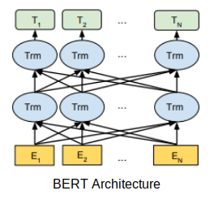
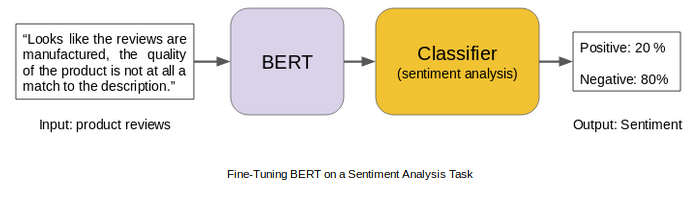

## BBC Text MultiClass Classification - BERT: Bidirectional Encoder Representations from Transformers

A jupyter notebook, Text classificaiton using BERT: Bidirectional Encoder Representations from Transformers

BERT stands for Bidirectional Encoder Representations from Transformers. It is designed to pre-train deep bidirectional representations from unlabeled text by jointly conditioning on both left and right context. As a result, the pre-trained BERT model can be fine-tuned with just one additional output layer to create state-of-the-art models for a wide range of NLP tasks.

Find more details about Bidirectional Encoder Representations from Transformers at [BERT](https://tfhub.dev/google/bert_uncased_L-12_H-768_A-12/1)


[](https://tfhub.dev/google/bert_uncased_L-12_H-768_A-12/1)

[](https://tfhub.dev/google/bert_uncased_L-12_H-768_A-12/1)

### Get BERT server and client

#### server

```bash
$ pip install bert-serving-server  
```
#### client, independent of bert-serving-server`

```bash
$ pip install bert-serving-client 
```

#### download BERT
```bash
$ wget https://storage.googleapis.com/bert_models/2018_10_18/uncased_L-12_H-768_A-12.zip && unzip uncased_L-12_H-768_A-12.zip
```

#### Run BERT Server
```bash
$ bert-serving-start -model_dir uncased_L-12_H-768_A-12/ -num_worker=2 -max_seq_len 50
```

Dataset link [bbc-fulltext-and-category](https://www.kaggle.com/yufengdev/bbc-fulltext-and-category)
